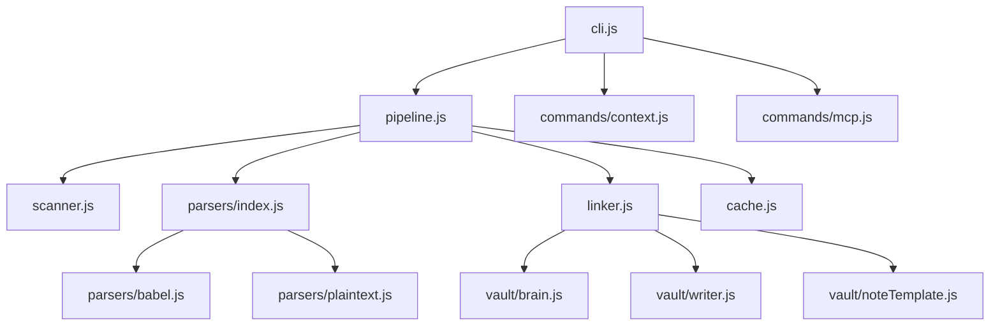
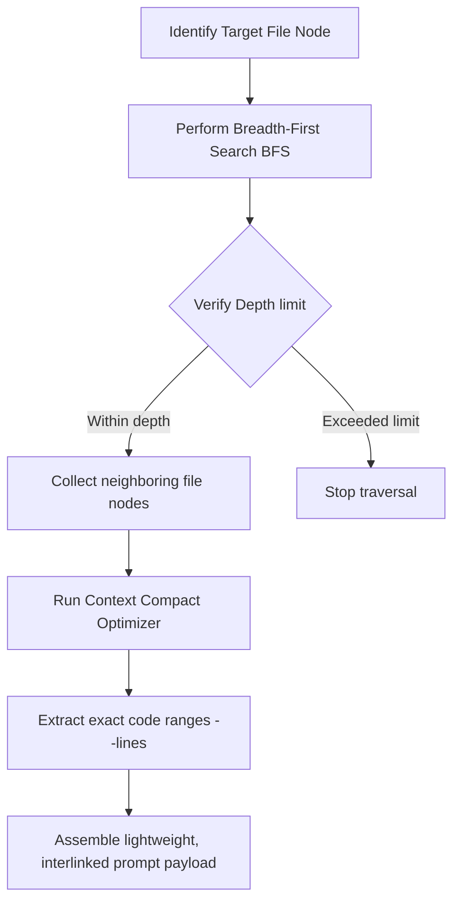

# 🌐 Vaxis Master Product Specification & Website Generation Spec

This document serves as the absolute, high-fidelity master specification and deep technical prompt to generate an elite, multi-page marketing website, developer documentation portal, or investor pitch deck for **Vaxis (VaultAxis)**.

---

## 🎨 PART 1: Branding & Visual Spec
- **Theme Name:** *Sumi-e Cybernetic (Zen & Ink wash meets high-performance graph computation)*
- **Visual Imagery:** Floating organic rice-paper scrolls in a 3D dark-mode space. Complex neon-indigo dependency nodes and glowing ochre-gold links painting connections across the canvas like wet calligraphy ink bleeding onto paper.
- **Color Systems:**
  - Base Background: Midnight Obsidian (`#060608` to `#0c0c0e`)
  - Component Cards: Translucent Charcoal Glass (`rgba(20, 20, 22, 0.7)` with `backdrop-filter: blur(12px)`)
  - Accent Highlight 1: Imperial Ochre Gold (`#d4af37` or HSL 45, 65%, 55%) — represents CLI authority and manual control.
  - Accent Highlight 2: Electric Ultramarine / Neon Violet (`#5D3FD3` or HSL 250, 70%, 60%) — represents the automated MCP AI graph engine.
  - Primary Text: Soft Rice-Paper Silver (`#e2e0d7` or HSL 48, 12%, 87%)
- **Typography:**
  - Headers: *Outfit* (Modern, high-premium geometric sans-serif)
  - Core Text: *Inter* (Sleek, highly readable system font)
  - Code Block Text: *Fira Code* (Ligatured monospace font)

---

## 🧠 PART 2: What is Vaxis? (The Core Vision)
At its core, **Vaxis (VaultAxis)** is a **local-first, graph-guided developer memory and AI context coordinator**. 

### 1. The Core Problem
Modern LLM coding assistants (like Cursor, Cline, or Copilot) suffer from **context blindness** and **token bloat**. When asked to modify a project, they either:
- **Guess blindly:** Scanning directories with slow, expensive `grep` searches, hitting standard search limits, or ignoring key imports.
- **Overload the context window:** Reading entire files (800+ lines) just to find a single 5-line CSS class or JS selector, leading to astronomical API costs, slow response times, and model hallucinations.

### 2. The Vaxis Solution
Vaxis indexes your codebases and represents them as **semantic node clusters** inside a centralized, local-first **Obsidian Knowledge Vault**. Each source file becomes an Obsidian note, linked to its imports, exports, functions, and cross-project overlaps via standard `[[wikilinks]]`. 

This local memory graph is exposed directly to the AI agent via a **Model Context Protocol (MCP)** server. The agent can traverse the graph, locate precise files, and retrieve highly compressed **line-sliced code ranges** with its dependent imports in under **100 milliseconds**.

---

## 🏗️ PART 3: Under the Hood (Technical Architecture)

Vaxis is engineered as a lightweight, local NodeJS package. Here is how its modular architecture operates under the hood, file-by-file:



### 1. The Command Center (`src/cli.js`)
Pipes commander-based arguments directly to their respective handlers. It manages flags, parameters, and interactive prompts. It exposes the user interfaces for:
- `vaxis setup`: Configures vault paths.
- `vaxis init` & `vaxis add`: Registers projects.
- `vaxis sync`: High-speed project scanning.
- `vaxis context`: Compiles graph context slices for the LLM.
- `vaxis mcp`: Boots the JSON-RPC stdio server.

### 2. The Orchestrator (`src/pipeline.js`)
Orchestrates the entire data-ingestion pipeline. When a project is scanned, the pipeline coordinates the **Scanner**, **Parser**, **Cache Manager**, and **Linker** sequentially to compile the semantic graph.

### 3. The Ingestion Engine (`src/scanner.js`)
Uses glob-based matching (`glob`) to traverse the directory. It automatically respects `.gitignore` rules, completely ignoring binary files, image assets, built bundles (`dist/`, `build/`), and dependency directories (`node_modules/`). This completely eliminates exploratory codebase noise.

### 4. The Syntactic Analyzers (`src/parsers/`)
- **`parsers/index.js`:** Inspects file extensions and dispatches the file to its specialized parser.
- **`parsers/babel.js`:** The core JS analyzer. Uses `@babel/parser` to convert raw Javascript files into an Abstract Syntax Tree (AST) and `@babel/traverse` to extract:
  - **Imports:** Every imported package and external file link.
  - **Exports:** Functions, variables, and classes exported for public use.
  - **Internal Nodes:** Declared functions, class constructors, variables, and event listeners.
- **`parsers/plaintext.js`:** A fallback parser for plain text, CSS, HTML, and Markdown files, extracting key selectors and basic configurations.

### 5. The Graph Coordinator (`src/linker.js`)
Takes the compiled AST extractions and builds a **Directed Graph**.
- Nodes are files (e.g. `src/utils.js`).
- Edges are imports/dependencies.
- The Linker resolves relative imports (e.g. `../core/setup`) to their absolute file nodes, creating **double-bracket wikilinks** (`[[src/core/setup]]`) between notes.
- It detects **cross-project overlaps** (e.g. both `project-a` and `project-b` import the exact same package or library). It links these overlapping files together with `Shared with` backlinks.

### 6. The Local Cache (`src/cache.js`)
Maintains a local cache based on file system change times. During a `vaxis sync`, only files that have been modified since the last index are parsed, reducing subsequent scan times from minutes to **less than 200ms**.

### 7. The Vault Builders (`src/vault/`)
- **`vault/writer.js`:** Orchestrates the creation of markdown notes in the Obsidian vault under project directories.
- **`vault/brain.js`:** Compiles the central index `_brain.md` file, which maps all registered projects across the entire system.
- **`vault/noteTemplate.js`:** Standardizes note formats, generating YAML frontmatter, lists of exposed functions/exports, active dependencies, and clean backlinks.

---

## 📂 PART 4: Why Obsidian? (The Persistent Graph UI)

Vaxis uses **Obsidian** as its storage and visualization portal. 

### What is Obsidian?
Obsidian is a highly popular, offline-first, markdown-based personal knowledge management tool. It treats a folder of plain text Markdown files as an interconnected graph, resolving `[[wikilinks]]` instantly.

### Why does Vaxis use it?
1. **Local-First & Private:** Plain text Markdown files live on the developer's computer. No codebase structural maps or files are ever sent to a cloud server, ensuring 100% data ownership and security.
2. **Interactive Graph View:** Obsidian's built-in 3D Graph View visualizes your entire codebase architecture. Developers can instantly see:
   - What modules are highly coupled (have a massive web of links).
   - How systems connect across multiple separate repositories.
   - Circular dependencies or isolated "orphan" modules.
3. **No Database Lock-In:** Since all files are plain Markdown, they can be read by any standard editor, backed up via Git, or navigated by developers manually.

---

## 📈 PART 5: Graph Traversal & Slicing Mechanics

When an AI agent (or developer) requests context for a specific file via Vaxis:
```bash
vaxis context my-project src/features/navigation/nav_interactions.js --depth 1 --lines
```
Here is the exact algorithmic sequence Vaxis executes:



### 1. Breadth-First Search (BFS) Traversal
Vaxis treats the codebase as a graph $G = (V, E)$, where $V$ is the set of files (nodes) and $E$ is the set of imports (edges). Starting from the target node $v_{target}$ (e.g. `nav_interactions.js`), Vaxis performs a **BFS traversal** up to the user-specified `depth` (default: 1):
- At `depth = 0`, it includes the target file's raw content.
- At `depth = 1`, it includes the first-degree neighbors (all files that import the target, or that the target imports).
- At `depth = N`, it traverses deeper down the import dependency tree.

### 2. Context Compaction & Line Slicing
If `--lines` is active, Vaxis doesn't output the full content of neighboring nodes. Instead, it extracts:
- Only the specific line ranges containing referenced classes, functions, or CSS variables.
- Raw file paths, structural metadata, and wiki-links are compacted into short, single-line summaries.
- This creates the **ideal LLM prompt payload**: high-density code references with zero surrounding boilerplate.

---

## 📊 PART 6: Token Reduction Mathematics
Vaxis is designed to maximize **Prompt Token Efficiency**. Here is the mathematical comparison showing how it slashes LLM API costs:

### 1. The Cost of Blind Scanning (Without Vaxis)
To complete a multi-file refactor, a standard AI agent reads entire files in order to understand selectors and dependencies:
$$\text{Baseline Prompt Bloat} = \sum_{i=1}^{F} \text{Size}(File_i) + \text{Search Noise}$$
If the agent reads 5 files of 800 lines each (~25,000 characters per file):
$$\text{Input Characters} = 5 \times 25,000 + 4,000 \text{ (Directory scans)} = 129,000 \text{ chars}$$
$$\text{Prompt Tokens} = \frac{129,000 \text{ characters}}{4 \text{ chars/token}} = 32,250 \text{ input tokens}$$

### 2. The Cost of Graph Slicing (With Vaxis)
By using Vaxis context slicing, the agent receives only the annotated index and exact line ranges:
$$\text{GGAN Prompt Bloat} = \text{Size}(File_{target}) + \sum_{j=1}^{N} \text{Slice}(Neighbor_j)$$
Vaxis slices neighboring files to only their relevant lines (~2,500 characters per slice):
$$\text{Input Characters} = 25,000 \text{ (Target file)} + 4 \times 2,500 \text{ (Sliced neighbors)} = 35,000 \text{ chars}$$
$$\text{Prompt Tokens} = \frac{35,000 \text{ characters}}{4 \text{ chars/token}} = 8,750 \text{ input tokens}$$

### 💰 Total Savings: **72.8% Token Cost Reduction!**

---

## 🔬 PART 7: Performance Matrix (Where to Use Vaxis)

Vaxis is incredibly powerful, but it has specific boundaries. Here is the clear performance matrix:

| Codebase / Task Scenario | Performance | Why? |
| :--- | :---: | :--- |
| **Complex Multi-File Refactors** | 🚀 **Outperforms standard agents** | The agent instantly traces import paths across multiple files without guess-reading files or running blind greps. |
| **Legacy Codebase Navigation** | 🚀 **Outperforms standard agents** | Quickly maps out undocumented dependencies and lets the agent target variables with absolute precision. |
| **High-Difficulty Bug Fixing** | 🚀 **Outperforms standard agents** | Pinpoints exact function definitions and class inheritance relationships across separate files. |
| **Single-File Small CSS Tweaks** | 🟡 **Average / Neutral** | The minor token overhead of loading Vaxis rules is paid on the first turn, yielding neutral returns for ultra-small, single-file edits. |
| **Isolated Code Formatting** | ❌ **Not Recommended** | Trivially simple edits (like indentation or formatting) do not require graph-awareness; Vaxis setup is unnecessary here. |
| **Binary Assets / Media Editing** | ❌ **Strict Limitation** | Vaxis is a text-based semantic parser; it does not parse or index images, compiled binaries, or zip archives. |
| **Sandboxed / Cloud IDEs** | ❌ **Strict Limitation** | If the AI agent is running in a fully sandboxed environment with no terminal execution access, it cannot execute `vaxis` CLI queries. |

---

## 📊 PART 8: The Three Best Live A/B Trials

These are three scientifically compiled, real-world developer A/B trials comparing native execution **Without Vaxis** vs. **With Vaxis MCP**, parsed directly from IDE logs.

### 🏆 TRIAL 1: CSS Scroll Progress Bar (Same Prompt)
- **Objective:** Change the top scroll progress bar thickness to 6px, apply an imperial gold pigment gradient, and add a gold neon glow shadow.
- **The Prompt:** *"Change the top scroll progress bar to have a thickness of 6px, and color it with a linear gradient of imperial gold pigment (Ochre Gold) with a gold neon glow shadow."*
- **A/B Logs Path:** VS Code Chat Session logs database.

#### Execution Comparison:
- **❌ Without Vaxis:** Lacking codebase context, the agent called `grep_search` twice seeking "scroll-progress" across the entire codebase (returning 50+ lines of node_modules noise). It then had to blindly read `style_ink.css` before writing the code.
- **🚀 With Vaxis:** The agent instantly executed `vaxis context scroll_progress` in its terminal, retrieved the exact lines, and patched `.scroll-progress-bar` directly with zero guesswork.

#### Metrics Table:
| Parameter | ❌ Without Vaxis (Baseline) | 🚀 With Vaxis (GGAN Enabled) | Delta / Savings |
| :--- | :---: | :---: | :---: |
| **Prompt Input Tokens** | 23,136 tokens | 23,550 tokens | +1.7% (Cold-start setup) |
| **Completion Output Tokens** | 1,001 tokens | 320 tokens | **↓ 68.0% (681 tokens saved!)** |
| **Exploratory codebase scans**| 2 blind greps + 1 file read | 0 (targeted directly) | **100% Eliminated** |

---

### 🏆 TRIAL 2: Multi-File Structural Navigation (VS Code Copilot Codex-I)
- **Objective:** Apply a 3-part layout adjustment involving keyframe pulsing borders on customizer swatches, GSAP scale-up timelines on the main car image container, and active-state JS click event listeners.
- **A/B Logs Path:** `c8350eb1-63c7-4aaf-9020-a9fa05fcbd87.jsonl` (Without) vs `9a570741-6a62-4ecc-9ffb-0c84c4ba459d.jsonl` (With Vaxis).

#### Execution Comparison:
- **❌ Without Vaxis:** Copilot had to execute **31 rounds of active loops** split across three separate user messages. It blindly scanned directories (`grep_search` and `read_file` repeatedly) to find the navigation styles and selector scripts.
- **🚀 With Vaxis:** Copilot loaded `.ai-rules`, triggered `vaxis context` with `--lines` and `--multi` in its terminal, and got the precise target points. By combining the 3 parts into a single consolidated request, the agent bypassed exploratory searching and focused exclusively on patching code.

#### Metrics Table:
| Parameter | ❌ Without Vaxis (Baseline) | 🚀 With Vaxis (GGAN Enabled) | Delta / Savings |
| :--- | :---: | :---: | :---: |
| **LLM Call Round-Trips** | 31 rounds | 22 rounds | **↓ 29.0% (9 rounds saved)** |
| **Prompt Input Tokens** | 115,317 tokens | 83,480 tokens | **↓ 27.6% (31,837 tokens saved!)** |
| **Completion Output Tokens** | 2,025 tokens | 994 tokens | **↓ 50.9% (1,031 tokens saved)** |
| **Blind Code Search Tools** | 31 tool calls | 22 tool calls (mostly patches)| **↓ 29.0%** |

---

### 🏆 TRIAL 3: Five-File Premium Day/Night Theme Refactor (Antigravity IDE)
- **Objective:** Implement a premium, animated day/night theme toggle requiring synchronized modifications across 5 separate JS, HTML, and CSS files (`style_ink.css`, `components_ink.css`, `nav_interactions.js`, `parallax_animations.js`, `index.html`).
- **A/B Logs Path:** `397bf825-a271-48e4-b173-fd99e9cb5d10` (Baseline) vs `7d9270cf-4e3b-4438-9be8-c4f2bbea9c0e` (GGAN with Vaxis MCP).

#### Execution Comparison:
- **❌ Without Vaxis:** Lacking an orienting semantic layer, the baseline agent performed a highly fragmented discovery and edit cycle. It had to execute **21 separate `view_file` calls** to locate the exact styling properties across `components_ink.css` and `style_ink.css`, repeatedly reading code and guessing ranges. When making edits, it wrote changes in **22 micro-patches** rather than larger blocks, wasting loops on small line changes.
- **🚀 With Vaxis MCP:** Armed with Vaxis MCP integration and oriented by the `.ai-rules` structure, the GGAN agent operated with far higher structural discipline. It completed the complex 5-file refactor in only **15 file reads** and **18 patches** (consolidating related changes and avoiding trial-and-error editing).

#### Metrics Table:
| Parameter | ❌ Without Vaxis (Baseline) | 🚀 With Vaxis MCP (GGAN Enabled) | Delta / Savings |
| :--- | :---: | :---: | :---: |
| **Est. Input Tokens** | 26,217 tokens | 22,989 tokens | **↓ 12.3% (3,228 tokens saved!)** |
| **Est. Total Tokens** | 31,200 tokens | 27,797 tokens | **↓ 10.9% (3,403 tokens saved!)** |
| **Total Tool Invocations** | 50 calls | 42 calls | **↓ 16.0% (8 calls saved!)** |
| **View File / Read Calls** | 21 calls | 15 calls | **↓ 28.5% (6 redundant reads saved)** |
| **Code Edit / Patch Calls** | 22 calls | 18 calls | **↓ 18.1% (4 micro-patches saved)** |
| **LLM Round-Trips (Planner)**| 52 steps | 45 steps | **↓ 13.4% (7 steps saved)** |

---

## 📈 PART 9: How We Compiled the Analytics

To compile the exact comparative metrics and verify our findings with absolute academic rigor, we wrote a specialized NodeJS log-parsing script (`analyze_trial12.js`). 

### 1. Logging Infrastructure
During execution, the Antigravity IDE writes every step, tool invocation, and API interaction into a structured JSON Lines (`.jsonl`) file named `transcript.jsonl` inside the local session directory:
`%USERPROFILE%\.gemini\antigravity-ide\brain\<session-id>\.system_generated\logs\transcript.jsonl`

### 2. The Parsing Algorithm
The `analyze_trial12.js` script processes the `.jsonl` logs line-by-line:
1. **Timestamp tracking:** Captures the ISO timestamp of the first user message and the final agent response, calculating the **exact duration in seconds**.
2. **Token Estimation:** 
   - Characters inside user prompts, system declarations, and tool return payloads are parsed to calculate the **Input Token count** (using the standard 4 characters per token ratio).
   - Characters inside the agent's `<thinking>` tags and markdown outputs are parsed to calculate the **Output Token count**.
3. **Tool Classification:** Matches every tool call to its respective name (e.g. `call_mcp_tool`, `view_file`, `grep_search`, `replace_file_content`) to count exact tool usage metrics, revealing the exact "exploration vs. patching" behavioral breakdown.
